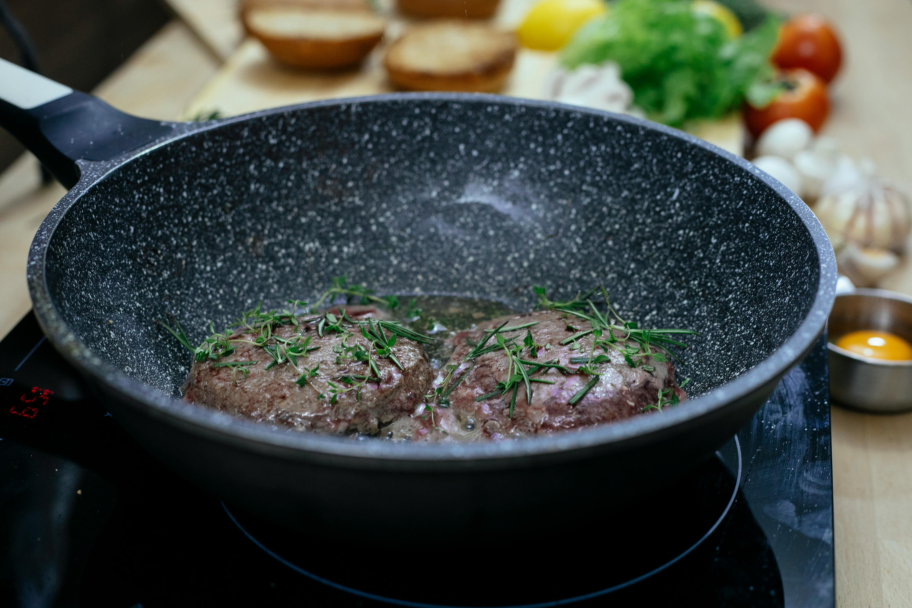

## Pizze

- margharitta  -20zł
- pepperoni    -23zł
- formaggio    -25zł

## dania mięsne

- kotlet devolay   - 15 zł
- nóżka z kurczaka - 18 zł
- kotlet schabowy  - 20 zł

## Zupy

- pomidorowa    - 13zł
- grzybowa      - 15zł
- krupnik       - 17zł

## spaghetti

- carbonara  - 22zł
